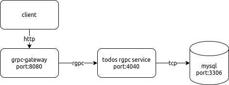

##  Todo list API using Golang with protobuf, and grpc-gateway

### Diagram:


### Setup with Docker:
  **Prerequisites**
  1. Docker & Docker Compose
  2. Git


  **Setup Instructions**
  1. Clone the project to local machine and go to the folder<br>
    ```
    git clone https://github.com/duckhue01/golang_test.git
    ```
    <br>
    ```
      cd ./golang_test
    ```
  2. Use docker compose to build images and run containers<br>
    ```
    docker-compose up --build
    ```

### Manually Setup:

### REST API Documentation:
  **Create Todo**
  ----
  Create a new todo item.
  * **URL** `/v1/todos`
  * **Method:** `POST`
    
  * **Success Response:**
    * **Code:** 200 OK <br />
      ```json
      {
        "api": "v1"
      }
      ```
  
  * **Sample Call:**

    ```json
      POST  http://127.0.0.1:8080/v1/todos HTTP/1.1
      Content-Type: application/json
      {
        "api":"v1",
        "todo":{
            "id":1,
            "title":"completing golang test",
            "description":"",
            "createAt":"2020-01-15T01:30:15.01Z",
            "updateAt":"2020-01-15T01:30:15.01Z",
            "isDone":false
        }
      }
    ```


  **Get All**
  ----
  Get all todos are stored in database
  * **URL** ` /v1/todos`
  * **Method:** `GET`
    
  * **Success Response:**

    * **Code:** 200 OK <br />  
      ```json
      {
        "api": "v1",
        "todo": [
          {
            "id": 2,
            "title": "duckhue01",
            "description": "asduckhue01d",
            "createAt": "2020-01-15T01:30:15Z",
            "updateAt": "2020-01-15T01:30:15Z",
            "isDone": false
          },
          {
            "id": 3,
            "title": "duckhue01",
            "description": "asduckhue01d",
            "createAt": "2020-01-15T01:30:15Z",
            "updateAt": "2020-01-15T01:30:15Z",
            "isDone": false
          }
        ]
      }
      ```
  
  * **Sample Call:**

    ```json
    GET http://127.0.0.1:8080/v1/todos HTTP/1.1
    ```
    
  **Get One**
  ----
  get one todos with id
  * **URL** `/v1/todos/:id` 
 
  
  * **Method:** `GET`
    
  * **Success Response:**

    * **Code:** 200 OK <br />  
      ```json
      {
        "api": "v1",
        "todo": {
          "id": 12,
          "title": "duckhue01",
          "description": "asduckhue01d",
          "createAt": "2020-01-15T01:30:15Z",
          "updateAt": "2020-01-15T01:30:15Z",
          "isDone": false
        }
      }
      ```
      * **Error Response:**

    * **Code:** 404 NOT FOUND <br />
      ```json
      {
        "code": 5,
        "message": "Todo with ID='12' is not found",
        "details": []
      }
      ``` 


  * **Sample Call:**

    ```json
    GET http://127.0.0.1:8080/v1/todos/12 HTTP/1.1
    ```


  **Update Todo**
  ----
  update existing todo
  * **URL** `/v1/todos/`
  
  
  * **Method:** `PUT`
    
  * **Success Response:**

    * **Code:** 200 OK <br />  
      ```json
      {      
        "api": "v1"
      }
      ```
  * **Error Response:**

    * **Code:** 404 NOT FOUND <br />
      ```json
      {
        "code": 5,
        "message": "Todo with ID='12' is not found",
        "details": []
      }
      ``` 
  
  * **Sample Call:**
    ```json
    PUT  http://127.0.0.1:8080/v1/todos HTTP/1.1
    Content-Type: application/json

    {
      "api":"v1",
      "todo":{
          "id":1,
          "title":"duckhue01",
          "description":"duckhue01",
          "createAt":"2020-01-15T01:30:15.01Z",
          "updateAt":"2020-01-15T01:30:15.01Z",
          "isDone":false
      }
    }
    ```


  **Delete Todo**
  ----
  delete existing todo
  * **URL** `/v1/todos/:id`
  
  
  * **Method:** `DELETE`
    
  * **Success Response:**

    * **Code:** 200 OK <br />  
      ```json
      {      
        "api": "v1"
      }
      ```
  * **Error Response:**

  * **Code:** 404 NOT FOUND <br />
    ```json
    {
      "code": 5,
      "message": "Todo with ID='12' is not found",
      "details": []
    }
    ``` 
  * **Sample Call:**
    ```json
    DELETE http://127.0.0.1:8080/v1/todos/1 HTTP/1.1
    ```